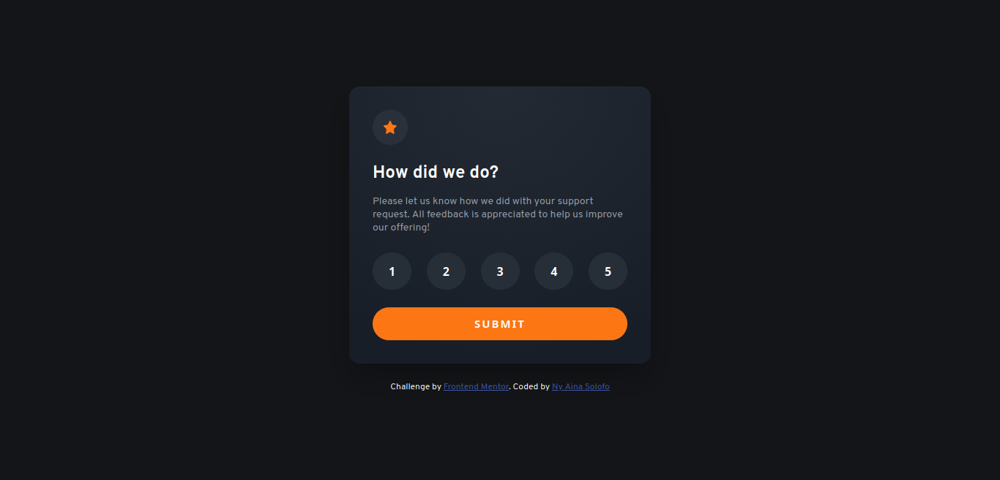

# Frontend Mentor - Interactive rating component solution

This is a solution to the [Interactive rating component challenge on Frontend Mentor](https://www.frontendmentor.io/challenges/interactive-rating-component-koxpeBUmI). Frontend Mentor challenges help you improve your coding skills by building realistic 

 

## Table of contents

- [Overview](#overview)
  - [The challenge](#the-challenge)
  - [Screenshot](#screenshot)
  - [Links](#links)
- [My process](#my-process)
  - [Built with](#built-with)
  - [What I learned](#what-i-learned)
  - [Useful resources](#useful-resources)
- [Author](#author)

 

## Overview

### The challenge

Users should be able to:

- [x] Select and submit a number rating
- [x] See the "Thank you" card state after submitting a rating
- [x] See hover and focus states for all interactive elements on the page

 

### Screenshot

 

### Links

- Solution URL: https://github.com/ny-aina-solofo/interactive-rating
- Live Site URL: https://ny-aina-solofo.github.io/interactive-rating/

 

## My process

### Built with

- Semantic HTML5 markup
- CSS custom properties
- Flexbox
- CSS Grid
- Mobile-first workflow

 

### What I learned

- Document Object Model

 

### Useful resources
- [MDN](https://developer.mozilla.org)

 

## Author
- Frontend Mentor - [@ny-aina-solofo](https://www.frontendmentor.io/profile/ny-aina-solofo)
- Github : https://github.com/ny-aina-solofo
&nbsp;

